STEP 1- INSTALL NodeJs

Updated and upgraded the Ubuntu server to the latest version by running the following codes.

`sudo apt update`

`sudo apt upgrade`

I added certificates using the following commands.

`sudo apt -y install curl dirmngr apt-transport-https lsb-release ca-certificates
`

`curl -sL https://deb.nodesource.com/setup_12.x | sudo -E bash`

Next, NodeJs is installed using the command:

`sudo apt install -y nodejs`

STEP 2- INSTALL MongoDB

For this application,  book records were added to MongoDB that contain book name, isbn number, author, and number of pages..

The following command was used to install MongoDB:

`sudo apt install -y mongodb`

The server is started using the command:

`sudo service mongodb start`

The screen shot below verifies that the server is up and running after running the command:

`sudo systemctl status mongodb`

Next, I installed the Install npm – Node package manager. I had some error messages that prevented the installation so I used the aptitude command to resolve the errors.

`sudo apt aptitude install -y npm`

'Body-parser' package is helpful in processing JSON files passed in request to the server.

The 'Body-parser' package is installed using the command:

`sudo npm install body-parser`

Next, a folder called books will be created. In this folder. npm project was initialized:

`mkdir Books && cd Books`

`npm init`

This created a package.jason file. A file named server.js will be added to it and then opened and the following code added inside and saved.

`vi server.js`

`var express = require('express');
var bodyParser = require('body-parser');
var app = express();
app.use(express.static(__dirname + '/public'));
app.use(bodyParser.json());
require('./apps/routes')(app);
app.set('port', 3300);
app.listen(app.get('port'), function() {
    console.log('Server up: http://localhost:' + app.get('port'));
});`

STEP 3- INSTALL EXPRESS AND SET UP ROUTES TO THE SERVER

Express will be used to and from our MongoDB database. Mongoose will be used to establish a schema for the database to store data for the book register.

The command below will be used to install Express and Mongoose.

`sudo npm install express mongoose`

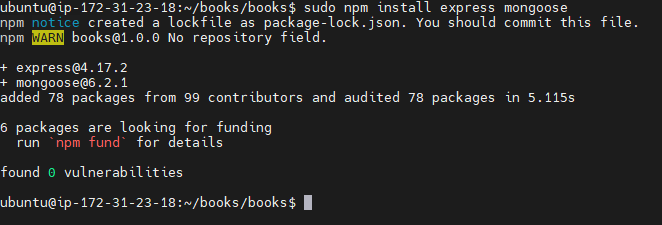

In the books folder, a folder named apps was created. 

`mkdir apps && cd apps`

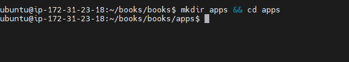

In the apps folder, a file named routes.js was created and the following code added and saved inside.

`vi routes.js`

`var Book = require('./models/book');
module.exports = function(app) {
  app.get('/book', function(req, res) {
    Book.find({}, function(err, result) {
      if ( err ) throw err;
      res.json(result);
    });
  }); 
  app.post('/book', function(req, res) {
    var book = new Book( {
      name:req.body.name,
      isbn:req.body.isbn,
      author:req.body.author,
      pages:req.body.pages
    });
    book.save(function(err, result) {
      if ( err ) throw err;
      res.json( {
        message:"Successfully added book",
        book:result
      });
    });
  });
  app.delete("/book/:isbn", function(req, res) {
    Book.findOneAndRemove(req.query, function(err, result) {
      if ( err ) throw err;
      res.json( {
        message: "Successfully deleted the book",
        book: result
      });
    });
  });
  var path = require('path');
  app.get('*', function(req, res) {
    res.sendfile(path.join(__dirname + '/public', 'index.html'));
  });
};`

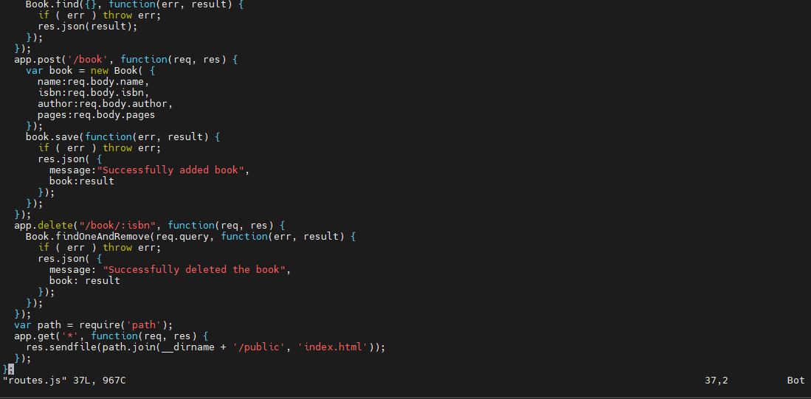

In the apps folder, a folder named models was created:

`mkdir models && cd models`

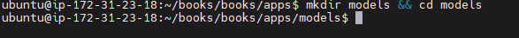

In the apps folder, a file named book.js was created and the following code added and saved in it.

`vi book.js`

`var mongoose = require('mongoose');
var dbHost = 'mongodb://localhost:27017/test';
mongoose.connect(dbHost);
mongoose.connection;
mongoose.set('debug', true);
var bookSchema = mongoose.Schema( {
  name: String,
  isbn: {type: String, index: true},
  author: String,
  pages: Number
});
var Book = mongoose.model('Book', bookSchema);
module.exports = mongoose.model('Book', bookSchema);`

STEP 4- ACCESS THE ROUTES WITH AngularJS

 AngularJS will be used to connect the  web page with Express and perform actions on the book register.

 I went back to the books directory and created a folder named public.

 

 `cd ../..`

 `mkdir public && cd public`

 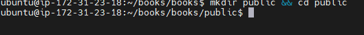

 In the "public" folder, a file named script.js will be opened. The following code will be added and saved in it.

 `vi script.js`

 `var app = angular.module('myApp', []);
app.controller('myCtrl', function($scope, $http) {
  $http( {
    method: 'GET',
    url: '/book'
  }).then(function successCallback(response) {
    $scope.books = response.data;
  }, function errorCallback(response) {
    console.log('Error: ' + response);
  });
  $scope.del_book = function(book) {
    $http( {
      method: 'DELETE',
      url: '/book/:isbn',
      params: {'isbn': book.isbn}
    }).then(function successCallback(response) {
      console.log(response);
    }, function errorCallback(response) {
      console.log('Error: ' + response);
    });
  };
  $scope.add_book = function() {
    var body = '{ "name": "' + $scope.Name + 
    '", "isbn": "' + $scope.Isbn +
    '", "author": "' + $scope.Author + 
    '", "pages": "' + $scope.Pages + '" }';
    $http({
      method: 'POST',
      url: '/book',
      data: body
    }).then(function successCallback(response) {
      console.log(response);
    }, function errorCallback(response) {
      console.log('Error: ' + response);
    });
  };
});`

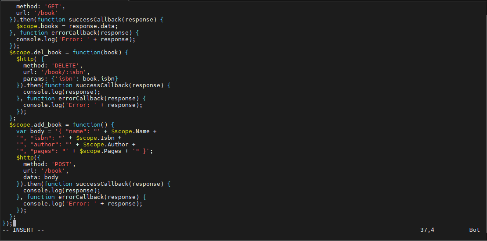

In the "Public folder", a file named index.html was created and the following code addded and saved in it.

`vi index.html`

`<!doctype html>
<html ng-app="myApp" ng-controller="myCtrl">
  <head>
    
    
  </head>
  <body>
    

      <table>
        <tr>
          <td>Name:</td>
          <td><input type="text" ng-model="Name"></td>
        </tr>
        <tr>
          <td>Isbn:</td>
          <td><input type="text" ng-model="Isbn"></td>
        </tr>
        <tr>
          <td>Author:</td>
          <td><input type="text" ng-model="Author"></td>
        </tr>
        <tr>
          <td>Pages:</td>
          <td><input type="number" ng-model="Pages"></td>
        </tr>
      </table>
      <button ng-click="add_book()">Add</button>
    

    

    

      <table>
        <tr>
          <th>Name</th>
          <th>Isbn</th>
          <th>Author</th>
          <th>Pages</th>

        </tr>
        <tr ng-repeat="book in books">
          <td>{{book.name}}</td>
          <td>{{book.isbn}}</td>
          <td>{{book.author}}</td>
          <td>{{book.pages}}</td>

          <td><input type="button" value="Delete" data-ng-click="del_book(book)"></td>
        </tr>
      </table>
    

  </body>
</html>`

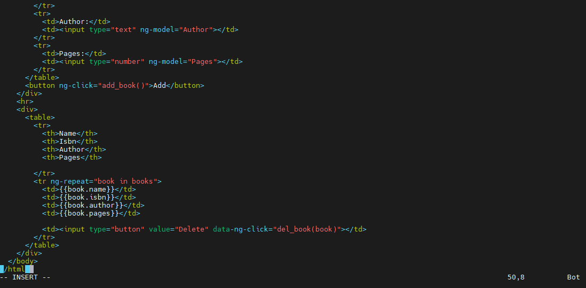

I went back to the books directory and the server was started  by running the following command:

`cd ..`

`node server.js`

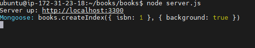

The screenshot above confirms the server is up and running and can be connected via port 3300.

The curl command below gives a test to see what the command returns locally. The out put is a html page which is hardly readable. 

`curl -s http://localhost:3300`

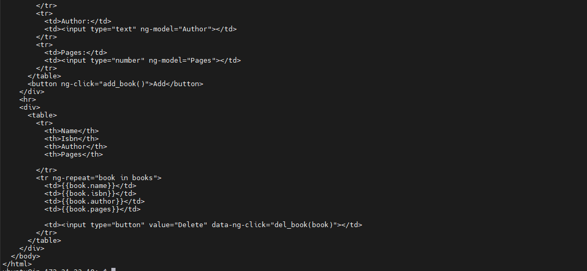

For this outpout to be clearer, there was need to open Port 3300 in the AWS console for the EC2 instance.

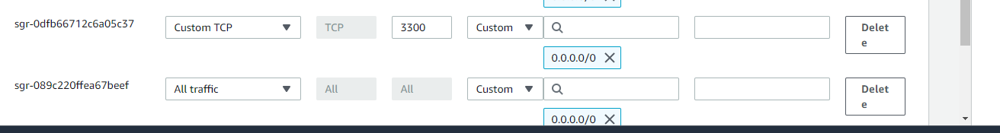

The screen shot below confirms the book register web application from the internet with a browser using a public IP address or a public DNS name can now be accessed.

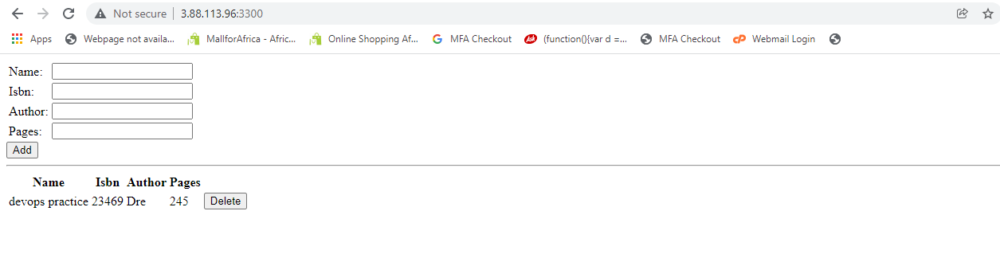

