STEP 1- INSTALL NodeJs

Updated and upgraded the Ubuntu server to the latest version by running the following codes.

`sudo apt update`

`sudo apt upgrade`

I added certificates using the following commands.

`sudo apt -y install curl dirmngr apt-transport-https lsb-release ca-certificates
`

`curl -sL https://deb.nodesource.com/setup_12.x | sudo -E bash`

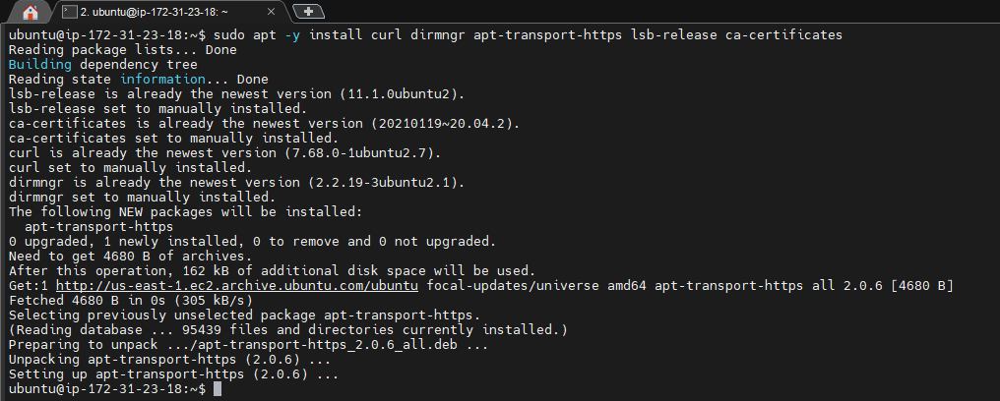

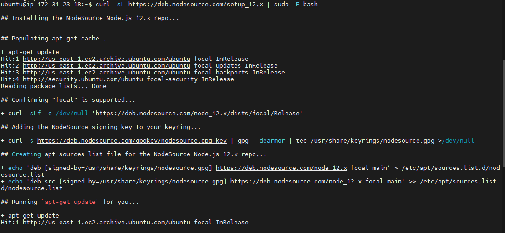

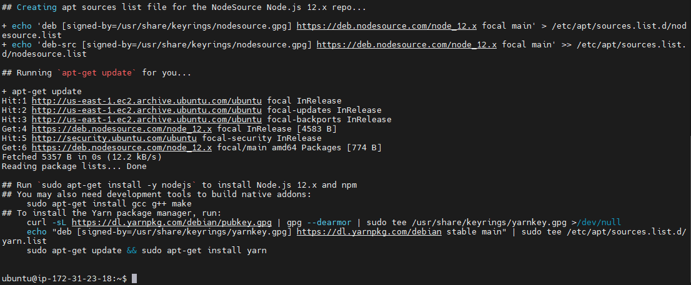

Next, NodeJs is installed using the command:

`sudo apt install -y nodejs`

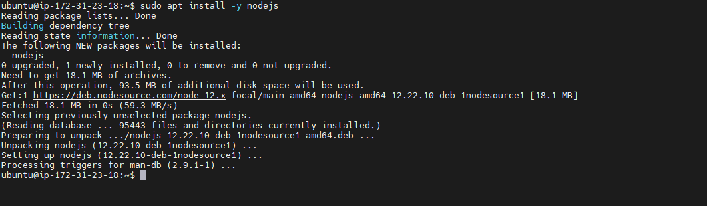

STEP 2- INSTALL MongoDB

For this application,  book records were added to MongoDB that contain book name, isbn number, author, and number of pages..

The following command was used to install MongoDB:

`sudo apt install -y mongodb`

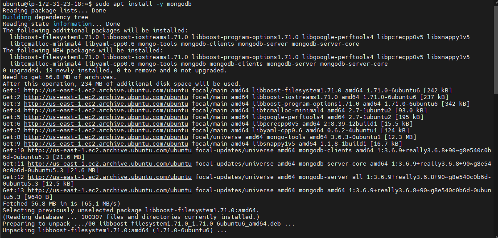

The server is started using the command:

`sudo service mongodb start`

The screen shot below verifies that the server is up and running after running the command:

`sudo systemctl status mongodb`

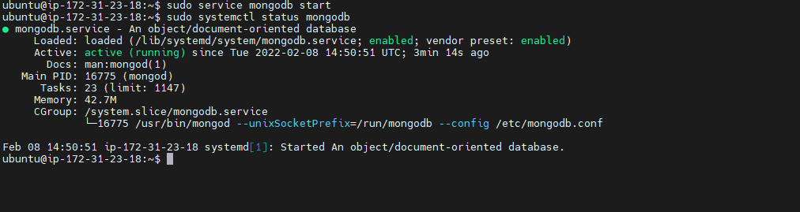

Next, I installed the Install npm – Node package manager. I had some error messages that prevented the installation so I used the aptitude command to resolve the errors.

`sudo apt aptitude install -y npm`

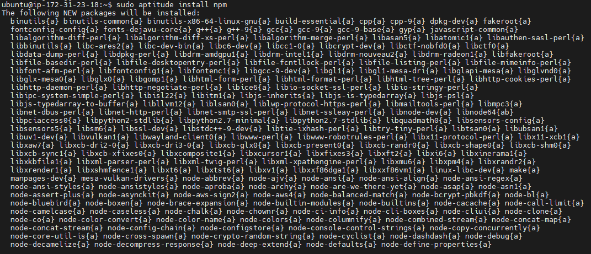

'Body-parser' package is helpful in processing JSON files passed in request to the server.

The 'Body-parser' package is installed using the command:

`sudo npm install body-parser`

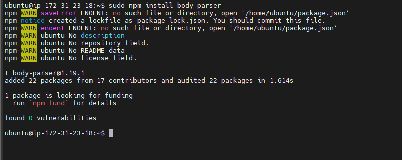

Next, a folder called books will be created. In this folder. npm project was initialized:

`mkdir Books && cd Books`

`npm init`

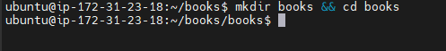

This created a package.jason file. A file named server.js will be added to it and then opened and the following code added inside and saved.

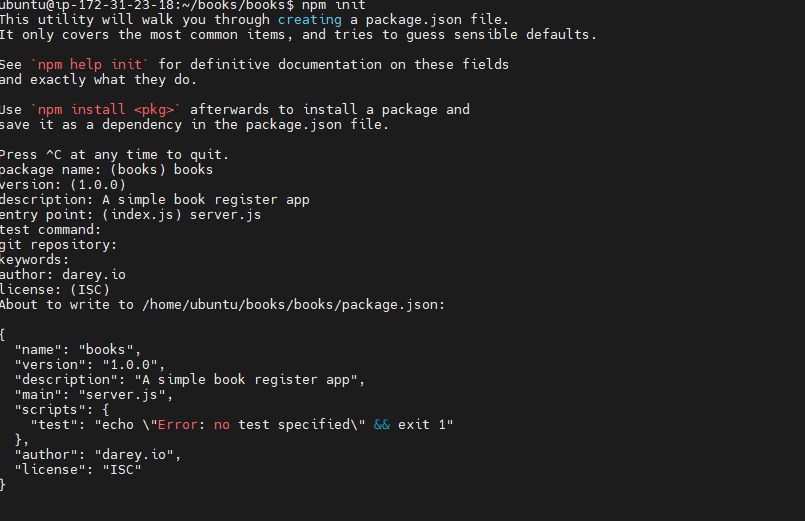

`vi server.js`

`var express = require('express');
var bodyParser = require('body-parser');
var app = express();
app.use(express.static(__dirname + '/public'));
app.use(bodyParser.json());
require('./apps/routes')(app);
app.set('port', 3300);
app.listen(app.get('port'), function() {
    console.log('Server up: http://localhost:' + app.get('port'));
});`

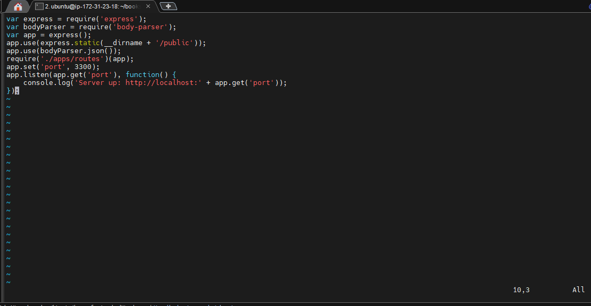